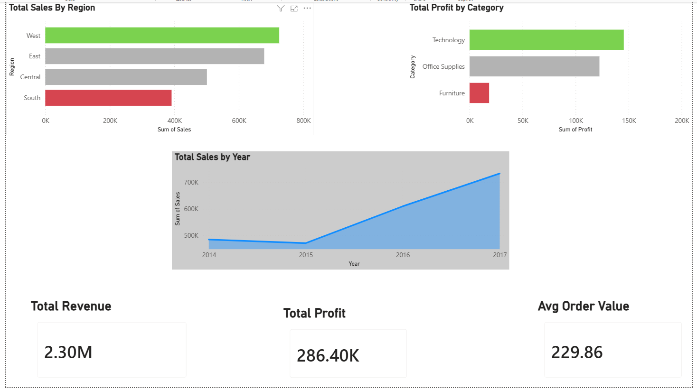

# Superstore Retail Sales Analysis

## Overview
End-to-end retail sales analytics pipeline ingesting data via Azure Data Factory, 
analyzing 9,994 orders using SQL, and visualizing insights in Power BI and Excel.

## Tools Used
- SQL / MySQL
- Microsoft Excel
- Azure Data Factory
- Power BI — Interactive dashboard with KPI cards and trend visuals

## Dataset
- Source: Kaggle — Superstore Sales Dataset
- 9,994 rows of retail transaction data
- 4 regions, 3 customer segments, 3 product categories

## Pipeline Architecture
1. **Excel** — Data profiling and pivot table analysis
2. **Azure Data Factory** — Ingested CSV from GitHub into Azure Blob Storage
3. **SQL/MySQL** — Queried and analyzed data across 5 business questions
4. **Power BI** — Interactive dashboard (coming soon)

## Key Insights
- West region leads in revenue ($725,457) and profit margin
- Central region underperforms due to Furniture/Tables losses (-$2,871)
- Tables is the most unprofitable subcategory across all regions
- Consumer segment drives most revenue ($1,150,166)
- Home Office has highest average order value ($246)
- January is peak sales month, July is the slowest
- Office Supplies produces the highest profit margins

## SQL Queries
1. Total Revenue and Profit by Region
2. Top 10 Products by Profit Margin
3. Month Over Month Sales Trend
4. Which Category Loses the Most Money
5. Customer Segment Performance

## Business Recommendations
- Reprice or discontinue Tables in the Central region
- Invest more in Office Supplies — highest margin category
- Run promotions in July to offset seasonal sales dip

## Files
- `Superstore_Sales_Analysis.sql` — All SQL queries
- `Superstore_Analysis.xlsx` — Excel pivot table analysis
- `superstore_clean_data.csv` — Raw dataset
- `Azure_Pipeline_Screenshot.png` — Azure Data Factory pipeline proof

## Dashboard
[View Live Power BI Dashboard](https://app.powerbi.com/reportEmbed?reportId=696f2e8b-68da-4479-8d05-54259a5f306a&autoAuth=true&ctid=5cdc5b43-d7be-4caa-8173-729e3b0a62d9)

## Dashboard Preview

